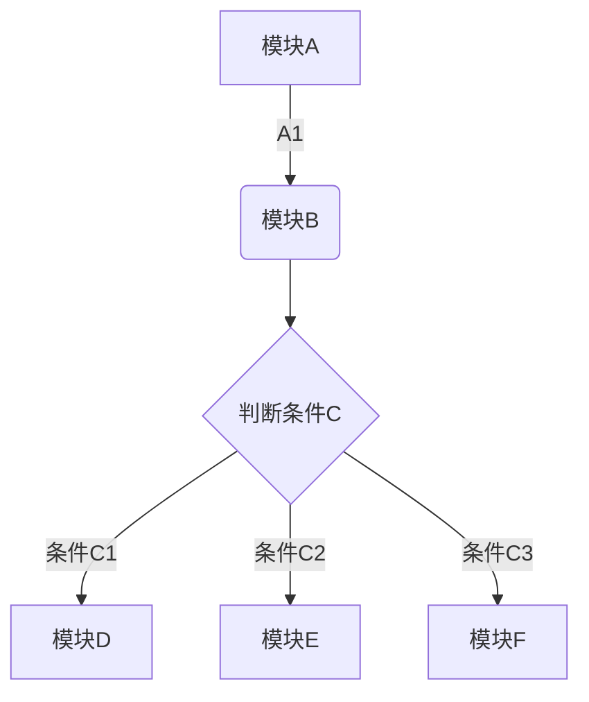
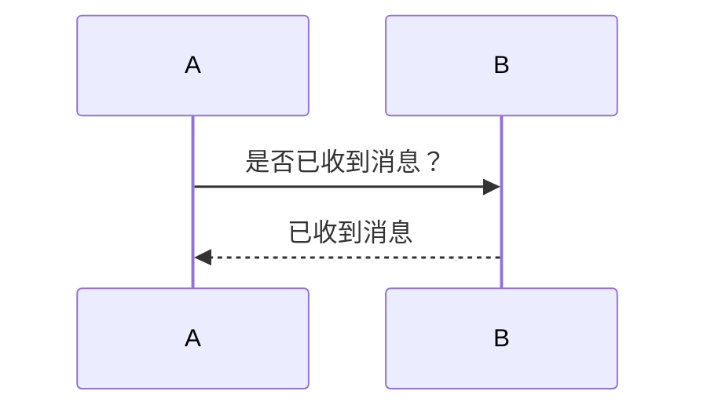
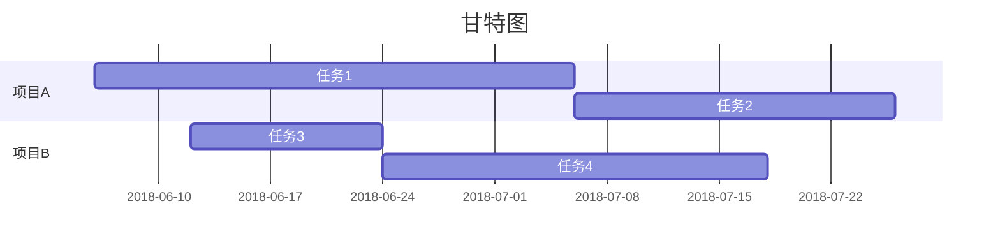

[toc]
# 一、Markdown 是什么？
Markdown 是一种轻量级的「标记语言」，创始人为约翰·格鲁伯，用简洁的语法代替排版，目前被越来越多的知识工作者、写作爱好者、程序员或研究员广泛使用。其常用的标记符号不超过十个，相对于更为复杂的 HTML 标记语言来说，Markdown 十分的轻量，学习成本也不需要太多，且一旦熟悉这种语法规则，会有沉浸式编辑的效果。

另外，印象笔记 Markdown 支持 `CommonMark` 和 `GFM (GitHub Flavored Markdown)` 标准。

# 二、印象笔记里 Markdown 有什么特点？

* **一键创建：** 支持 Markdown 独立的一键新建入口，为深度 Markdown 用户提供更好的效率体验；
* **支持丰富的主流 Markdown 语法：** 支持文字相关样式、序号列表、任务列表、表格、TOC 目录、多种图表、数学公式、流程图、时序图、甘特图等；
* **支持插入图片：** 可插入网络图片 或 直接拖动本地图片、复制剪贴板中的图片到 Markdown 笔记中；
* **支持多种模式切换：** 编辑与预览模式、纯编辑模式以及纯预览模式；
* **支持多种编辑主题：** 预置了白色、黑色、深空灰和印象绿主题，默认为印象绿，未来会有更多主题提供；
* **跨平台同步：** 创建的 Markdown 笔记可在登录了印象笔记帐户的各端查看，未来更多端会支持创建和编辑 Markdown 笔记；
* **演示模式：** Markdown 笔记支持演示模式查看；
* **支持其他印象笔记特点功能：** 笔记标注、导出 PDF、设置提醒、工作群聊共享-查看&编辑笔记等。

# 三、如何创建 Markdown 笔记？

1. 点击左上角 ***「新建 Markdown 笔记」*** 来创建新的 Markdown 笔记，另外，也支持配置隐藏 ***「新建 Markdown 笔记」*** 按钮，Windows 用户直接右单击 ***「新建 Markdown 笔记」*** 按钮，即可隐藏，Mac 用户可以右单击左侧边栏空白处，取消勾选 ***「新建 Markdown 笔记」*** 来完成隐藏此按钮
2. 点击菜单栏-文件-新建笔记-新建 Markdown 笔记（Mac 上为顶部菜单栏-文件-新建 Markdown笔记）
3. 使用快捷键 `Ctrl+alt+D`（Mac 上`CMD+D`）来快速创建 Markdown 笔记
4. 
# 四、印象笔记 Markdown 笔记支持哪些语法？ 
> 以下语法均支持在编辑工具栏直接操作

## 文本格式

### 设置分级标题

语法示例：
```markdown
# 一级标题
## 二级标题
### 三级标题
#### 四级标题
##### 五级标题
###### 六级标题
```

### 加粗文本
语法示例：
**印象笔记**

###  斜体
 语法示例：
*印象笔记*

### 下划线
 语法示例：
<u>印象笔记</u>

### 删除线
 语法示例：
~~印象笔记不支持Markdown~~

### 添加分隔线
 语法示例：
* * *

## 段落格式

### 引用文本
 语法示例：
>近日，印象笔记宣布完成重组。作为Evernote已在中国独立运营近6年的品牌，印象笔记将成为由中方控股的中美合资独立运营实体，并获得红杉宽带跨境数字产业基金首轮数亿元人民币投资。

### 添加符号列表或者数字列表
 语法示例：
使用 iOS 版本印象笔记如何快速保存内容？
1. 启用印象笔记 Widget ——印象笔记·剪贴板
2. 复制粘贴任意内容     
* 微信
3. 滑动到 Widget 插件区域即可完成保存印象笔记·剪贴板有什么特点？
* 快：开启自动模式，可以自动保存剪贴板的任意内容
* 一切：只要可以复制粘贴就可以保存
* 有序：全部保存在「我的剪贴板」笔记本并以时间来命名

### 添加待办事项
 语法示例：
三只青蛙
* [x] 第一只青蛙
* [ ] 第二只青蛙
* [ ] 第三只青蛙

### 插入链接
 语法示例：
[印象笔记官网](https://www.yinxiang.com/)

### 插入图片
 印象笔记支持嵌入网络图片或者直接拖入本地图片，其中本地图片格式支持 jpg、png 和 gif。语法示例：


另外，针对插入的本地图片可以控制图片大小，在拖拽、拷贝或者点击插入本地图片之后，直接在图片名称后面（无需空格）添加以下语法均可以按照以下要求控制图片大小：
```
@w=300
@h=150
@w=200h=100
@h=100w=200
```
示例笔记
`782d277a1dbc7dea8480267cf5f87ebd.png@w=300`

## 块格式

### 插入表格
 语法示例：
| 帐户类型 | 免费帐户 | 标准帐户 | 高级帐户 |
| --- | --- | --- | --- |
| 帐户流量 | 60M | 1GB | 10GB |
| 设备数目 | 2台 | 无限制 | 无限制 |
| 当前价格 | 免费 | ￥8.17/月 | ￥12.33/月|

### 插入图表
 目前支持饼状图、折线图、柱状图和条形图，只需将 type 改为对应的`pie、line、column 和 bar`。
 
```chart
,预算,收入,花费,债务
June,5000,8000,4000,6000
July,3000,1000,4000,3000
Aug,5000,7000,6000,3000
Sep,7000,2000,3000,1000
Oct,6000,5000,4000,2000
Nov,4000,3000,5000,

type: pie
title: 每月收益
x.title: Amount
y.title: Month
y.suffix: $
```

### 插入行内代码或代码块
印象笔记 Markdown 语法支持几十种编程语言的高亮的显示。语法示例：
```python
@requires_authorization
def somefunc(param1='', param2=0):
    r'''A docstring'''
    if param1 > param2: # interesting
        print 'Gre\'ater'
    return (param2 - param1 + 1 + 0b10l) or None

class SomeClass:
    pass

>>> message = '''interpreter
... prompt'''
```

```java
/**
 * @author John Smith <john.smith@example.com>
*/
package l2f.gameserver.model;

public abstract class L2Char extends L2Object {
  public static final Short ERROR = 0x0001;

  public void moveTo(int x, int y, int z) {
    _ai = null;
    log("Should not be called");
    if (1 > 5) { // wtf!?
      return;
    }
  }
}
```
### 插入数学公式
印象笔记 Markdown 支持绝大多数的 LaTeX 数学公式,语法示例：
```math
e^{i\pi} + 1 = 0
```

>更多数学公式的输入可以参考： [https://khan.github.io/KaTeX/docs/supported.html](https://khan.github.io/KaTeX/docs/supported.html)

### LaTeX 公式

可以创建行内公式，例如 $\Gamma(n) = (n-1)!\quad\forall n\in\mathbb N$。或者块级公式：

$$	x = \dfrac{-b \pm \sqrt{b^2 - 4ac}}{2a} $$
### 插入流程图
 语法示例：


### 插入时序图
 语法示例：


### 插入甘特图
 语法示例：

> **提示：**想了解更多，请查看**流程图**[语法][3]、**时序图**[语法][4]、**甘特图**[语法][5]。


## 插入目录
设置目录设置之后可以自动根据设置的分级标题来自动生成目录。语法示例：
`[TOC]`

## 快捷键

新建 Markdown 笔记  ``CMD+D``
粗体 `CMD+B`
斜体 `CMD+I`
删除线 `CMD+S`
分隔线 `CMD+L`
编号列表 `CMD+Shift+O`
项目符号列表 `CMD+Shift+U`
插入待办事项 `CMD+Shift+T`
代码块 `CMD+Shift+P`
撤销 `CMD+Z`
在笔记内搜索 `CMD+F`

[3]: https://mermaidjs.github.io/flowchart.html
[4]: https://mermaidjs.github.io/sequenceDiagram.html
[5]: https://mermaidjs.github.io/gantt.html

